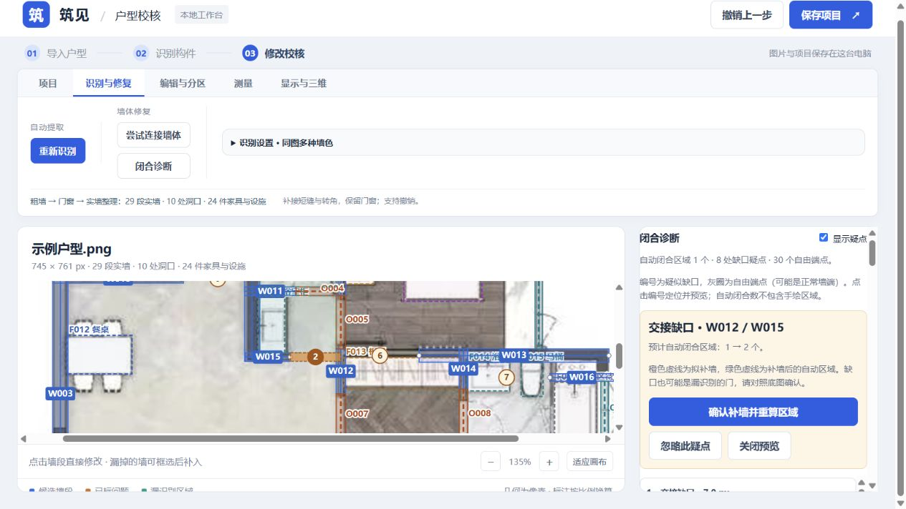

# P12 闭合诊断与缺口定位核查

2026-10-02。入口：识别与修复 → 闭合诊断。

## 行为

- 对真实实墙段端点寻找共线、L/T 交接补接候选，图上编号与列表可定位。自由端点不是漏墙证明；已连接门窗或待确认洞口的端点不列为自由端点。
- 点击候选仅在副本中模拟补墙：橙色虚线显示拟补墙，绿色虚线显示预计自动分区，并列出自动闭合区域数量变化。手绘轮廓不计作墙体闭合证据。预览不改变墙体、面积、保存内容、编号或撤销栈。
- 用户确认后新增可编辑墙段，保留原墙；区域与面积重算，三维使用更新后的墙体。忽略和恢复只改变疑点记录。两种修改均可撤销、保存、重新打开。
- 项目变化即作废旧预览并重查；服务端重新生成候选并核对文档摘要，拒绝过期和伪造的候选。未知字段不能用来注入拟补墙几何。
- 已识别的门、窗、待确认边界、连接跨度和手工洞口约束均受保护。未接齐两端的门窗和待定边界另外列出，可跳转校核。

## 验证

```powershell
.\.venv\Scripts\python.exe -m unittest test_closure test_connections test_rooms test_room_editing
.\.venv\Scripts\python.exe -m unittest test_projects test_web test_model_settings
node --test test_model_geometry.mjs test_floor_geometry.mjs test_wall_lengths.mjs test_room_areas.mjs test_furniture_models.mjs
```

- Python：31 + 20 项通过，其中 10 项为新增缺口/接口测试。覆盖预览只读、确认闭合、共线/L/T 与转置、亚像素裂缝、长缝及错位排除、第三堵墙阻挡、门窗/手工洞口保护、过期/伪造请求拒绝、忽略/恢复、手绘区域保留、保存重开与撤销。
- JavaScript：29 项三维几何、地面、墙长、面积及家具回归通过。新增脚本与修改后的 app.js 语法检查通过。
- 浏览器：真实示例图得到 8 处疑点、30 个待查实墙端点、1 个自动闭合区域。预览 W024/W025 不改变区域数量；忽略→恢复→确认→撤销均通过，确认新增一段实墙，撤销恢复原文档及未分区状态。
- 预览 W012/W015 显示自动区域 1 → 2；确认后得到 2 个区域，诊断自动更新为 7 处疑点。页面错误日志为空。截图为确认前的预览。
- 两份已保存识别样本的诊断计数与本机耗时见 [results.json](results.json)：pipeline-v1 为 8 候选，doors-v3 为 6 候选，后者另外发现 5 个未接齐的门窗。计数不是识别准确率。



## 边界

- 几何相近仅提供疑点，不表示原图一定有墙；漏识别的门、开放空间仍需人工判断，没有批量自动封闭。
- 限于轴对齐墙段，候选延伸不超过局部较薄墙厚的 12 倍及图片短边的 20%，两者取小。排除跨越第三堵墙、越界、明显厚度不匹配和错位共线墙。扫描最多前 600 实墙段之间的组合，展示最多 100 候选，触及限制会提示。零候选不是全闭合证明。
- 单处预览不联合推断多个缺口。区域数不变可能仍有其他缺口或只是正常墙端；区域数变化也不能证明补墙正确。
- 自动房间轮廓变化后仍需校核用途与材质。现有手绘区域和材质编辑记录保留。
- 顶部旧连接状态统计墙轴线自由端点；新诊断统计排除已识别洞口后的实墙端点，两者口径不同。
- 长距离漏墙、错位/斜墙/圆角、全局闭合保证、重叠墙合并与三维网格合并仍留在 FEATURES 的 P12 后续。
