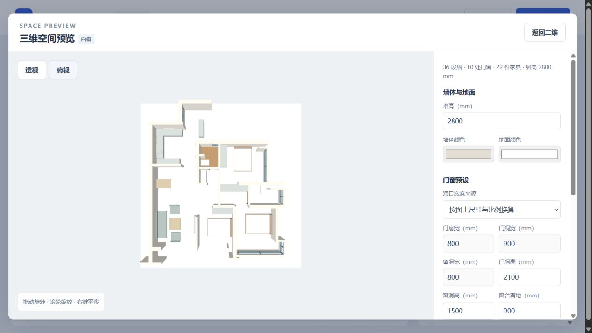

# 墙厚估算与区域地面核查

2026-09-28，完成待办 P02、P08。墙长标注和房间面积仍在 P13、P14，不在本次范围。

## 操作

1. 识别图片。优先拉线输入已知长度；缺少长度时，展开“备选：按墙厚估算比例”，选择实墙并输入实际厚度。例如图上 10 px、实际 200 mm，比例为 20 mm/px。
2. 点击“分割区域”。点选区域可命名并选择纯色、瓷砖或木地板；板块宽长使用 mm，方向使用度数。
3. 漏区用“手绘补区域”，逐个点击轮廓拐点并完成闭合。已有区域支持重画、切分、合并和排除；切分线两端应落在区域外侧。
4. 查看三维，按区域显示铺装。设置支持撤销；保存项目同时保留原始手绘轮廓、材质和当前有效分区。

## 验证

- 45 项相关 Python 测试通过：墙厚估算与重新标定、无效参数和轮廓拒绝、手绘新增/重画/切分/合并/排除、实墙裁切、自动区域与手绘互斥、材质保留、API 保存与连续撤销，以及既有墙体连接和编辑回归。
- 12 项 Node 三维几何测试通过：凹形/孔洞三角化、比例换算、按实际板块尺寸生成纹理坐标和旋转，以及既有门窗洞口与墙体几何回归。
- 浏览器实测：默认图识别→分区→W004 实际厚度 200 mm 得到 20 mm/px；选中原区域后手绘新增，候选数由 1 增至 2；切分增至 3、合并回到 2；重分区仍保留手绘区；分别应用木地板、瓷砖并检查三维。浏览器未记录脚本错误。
- API 测试确认保存的 `walls.json` 与当前文档相同，`regions.json` 与有效分区相同；逐次撤销新增、材质、估算后回到原文档。
- 收尾再次通过页面完成材质撤销、重新应用与保存；默认端口 8765 启动成功。下图为自动闭合候选区域铺木地板的示例，其余未校核区域仍显示基础地面。



复现（在 `wall-recognition` 目录，先安装 requirements.txt）：

```powershell
python -m unittest test_room_editing test_rooms test_refinement test_connections test_web test_engine test_model_settings -v
node --test test_model_geometry.mjs test_floor_geometry.mjs
```

## 边界

- 仍需人工校核漏墙和漏门，手绘补区不会修复真实墙体。合并只合并现有覆盖范围，墙体仍保留。
- 木纹和瓷砖为本地程序示意纹理，未做真实材质渲染、排砖用量或损耗计算。
- 自动区域按轮廓关联材质；边界改变后需重新检查，避免编号变化导致材质串房间。手绘轮廓优先且持续保留，后续墙体改动会重新裁切地面。
- 墙厚估算记录选择时的图上厚度，普通墙段编辑不会自动重定全局比例。该方式仍是备选，已知长度时优先拉线标定。
- 已保存项目从页面重新导入仍是待办 P10。
