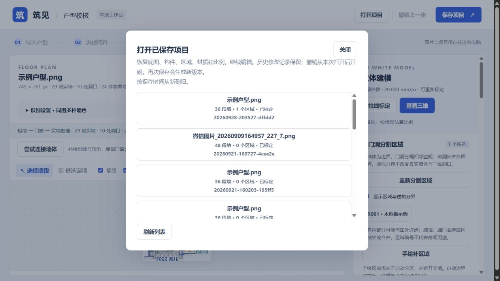
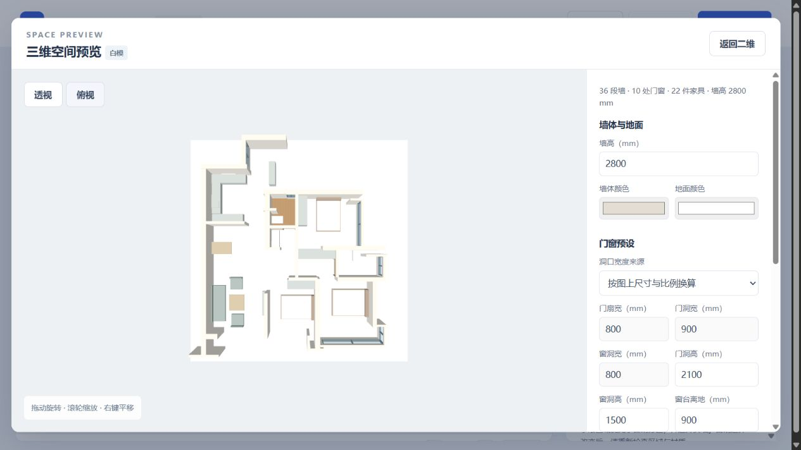

# 已保存项目恢复核查

2026-09-28，完成 P10。入口为顶部“打开项目”，每次保存继续生成独立版本。

## 当前能力

- 列出本机 `projects/` 最近 100 个保存版本，显示文件名、墙段数、区域数、标定状态和版本编号。
- 恢复原图、二维构件、分区、手绘轮廓、每区材质、比例、三维设置与修改记录，不重新运行识别或分区。
- 打开前确认未保存修改；取消保留草稿，加载失败保留当前项目。加载成功才替换画布。
- 继续编辑后可撤销并保存为新版本，原保存文件不覆盖。历史修改记录保留，历史撤销快照尚未持久化，撤销从本次打开后开始。
- 支持当前及已有 0.3.0 项目。旧项目缺少家具列表时按空列表恢复；没有 project.json 时仍可打开并恢复后续编号。早期 0.1 格式暂不支持，列表明确提示。

## 验证

5 项新增测试通过，覆盖保存后丢失会话再恢复、无重新识别、完整文档和图片一致、恢复后补墙编号、继续编辑撤销、另存不覆盖、旧项目兼容、空列表、损坏文件、路径越界、请求保护、底图不匹配及失败不替换会话。

28 项相关回归通过（test_web、test_room_editing、test_rooms、test_model_settings）。前端语法与 diff 检查通过。

页面实测：恢复已有木地板示例，区域名称、材质与 20 mm/px 墙厚估算保持；历史记录显示，新会话撤销按钮禁用。修改区域名称未提交时切换项目，取消后草稿保留；确认放弃后能恢复较早项目，原区域表单清空，不串入旧区域。

本机 12 份 0.3.0 保存项目全部通过加载校验；另 1 份早期 0.1 项目显示不支持。恢复后的三维显示 36 段墙、10 处门窗、22 件家具，木地板仍保留；浏览器未记录脚本错误。





```powershell
python -m unittest test_projects -v
python -m unittest test_web test_room_editing test_rooms test_model_settings -v
node --check web/app.js
node --check web/room-ui.js
```
